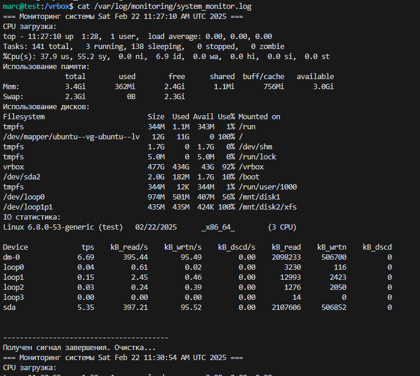

# Меню

- [Работа скрипта](#Работа-скрипта)
- [Сам скрипт](#Сам-скрипт)

## Работа скрипта




## Сам скрипт

```bash
#!/bin/bash

set -e

# Директория для логов
log_dir="/var/log/monitoring"
log_file="$log_dir/system_monitor.log"
error_log="$log_dir/error.log"
debug=0

# Функция для очистки старых логов (старше 3 дней)
cleanup_logs() {
    find "$log_dir" -type f -name "*.log.*" -mtime +3 -exec rm {} \;
}

# Функция для ротации логов
rotate_logs() {
    local file="$1"
    if [ -f "$file" ]; then
        mv "$file" "$file.$(date +%Y%m%d)"
    fi
}

# Обработчик сигналов
cleanup() {
    echo "Получен сигнал завершения. Очистка..." >> "$log_file"
    cleanup_logs
    exit 0
}

# Установка обработчиков сигналов
trap cleanup SIGINT SIGTERM

# Создание директории для логов если её нет
mkdir -p "$log_dir"

# Проверка аргументов
while getopts "d" opt; do
    case $opt in
        d) debug=1 ;;
    esac
done

# Включение режима отладки если запрошено
[ $debug -eq 1 ] && set -x

# Основной цикл мониторинга
while true; do
    # Ротация логов в начале дня
    if [ "$(date +%H:%M)" = "00:00" ]; then
        rotate_logs "$log_file"
        rotate_logs "$error_log"
    fi

    # Timestamp
    echo "=== Мониторинг системы $(date) ===" >> "$log_file"

    # CPU загрузка
    echo "CPU загрузка:" >> "$log_file"
    top -bn1 | head -n 3 >> "$log_file" 2>> "$error_log"

    # Память
    echo "Использование памяти:" >> "$log_file"
    free -h >> "$log_file" 2>> "$error_log"

    # Диски
    echo "Использование дисков:" >> "$log_file"
    df -h >> "$log_file" 2>> "$error_log"

    # IO статистика
    echo "IO статистика:" >> "$log_file"
    iostat -d 1 1 >> "$log_file" 2>> "$error_log"

    echo "----------------------------------------" >> "$log_file"

    # Очистка старых логов
    cleanup_logs

    # Пауза 5 минут
    sleep 300
done
```

