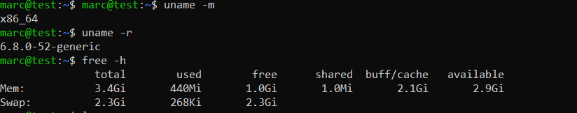
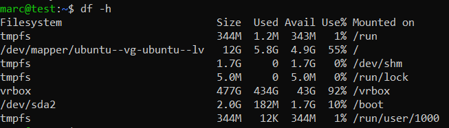
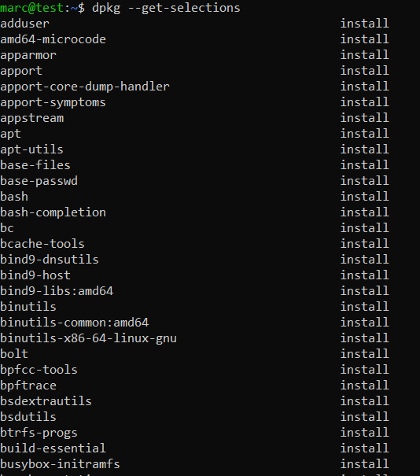

# Отчет о системе

- [Основные характеристики системы](#Основные-характеристики-системы)
- [Установленные по умолчанию пакеты](#Установленные-по-умолчанию-пакеты)
- [Процесс загрузки системы](#Процесс-загрузки-системы)
- [Краткий анализ](#Краткий-анализ)

## Основные характеристики системе

## Установленные по умолчанию пакеты

## Процесс загрузки системы

Процесс загрузки системы в Linux можно разбить на несколько этапов:

1. **BIOS/UEFI**: 
   При включении компьютера BIOS или UEFI выполняет начальную проверку оборудования и загружает загрузчик.

2. **Загрузчик (GRUB)**: 
   GRUB (или другой загрузчик) загружает ядро операционной системы. Он может предоставить меню для выбора между несколькими установленными системами.

3. **Загрузка ядра**: 
   Загрузчик загружает ядро в память и передает управление ему. Ядро инициализирует оборудование и монтирует корневую файловую систему.

4. **Инициализация системы**: 
   После загрузки ядра запускается процесс инициализации (обычно это `systemd` или `init`), который управляет запуском всех необходимых служб и процессов.

5. **Графическая среда**: 
   Если система настроена для работы с графическим интерфейсом, запускается дисплейный менеджер (например, GDM, LightDM), который предоставляет экран входа в систему.

## Краткий анализ

**Ubuntu Desktop** — это версия операционной системы Ubuntu, предназначенная для использования на настольных компьютерах и ноутбуках. Она подходит для следующих задач:

## Десктопные задачи:
- **Офисные приложения**: редактирование документов, работа с таблицами и презентациями.
- **Веб-серфинг** и работа с электронной почтой.
- **Мультимедийные задачи**: просмотр видео, работа с графикой и музыкой.

## Разработка:
- Подходит для разработчиков благодаря поддержке множества языков программирования и инструментов разработки.

## Образование:
- Часто используется в учебных заведениях благодаря своей доступности и большому количеству образовательных программ.

## Серверные задачи:
- Хотя Ubuntu Desktop не является серверной версией, она может использоваться для легких серверных задач, таких как хостинг веб-сайтов или баз данных, но для более серьезных серверных задач рекомендуется использовать **Ubuntu Server**.

## Легкость в использовании:
- Ubuntu Desktop имеет интуитивно понятный интерфейс, что делает его подходящим для пользователей, не имеющих опыта работы с Linux.

---

Таким образом, **Ubuntu Desktop** является универсальной операционной системой, подходящей для широкого спектра задач, от повседневного использования до разработки и легких серверных приложений.